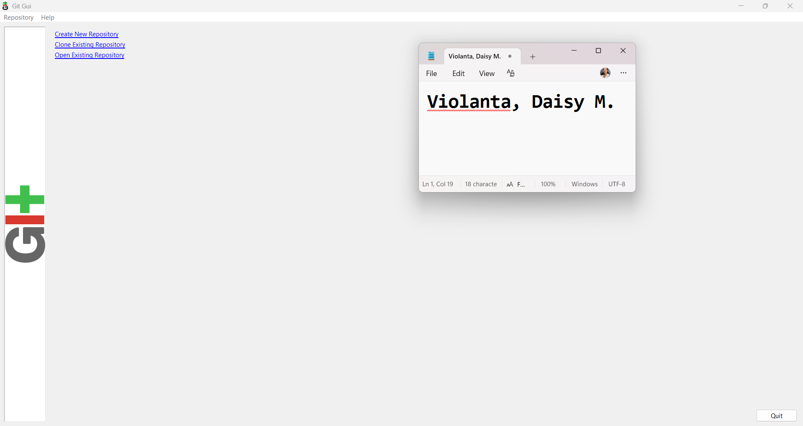
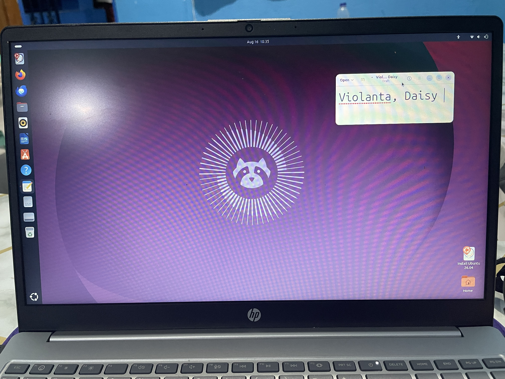
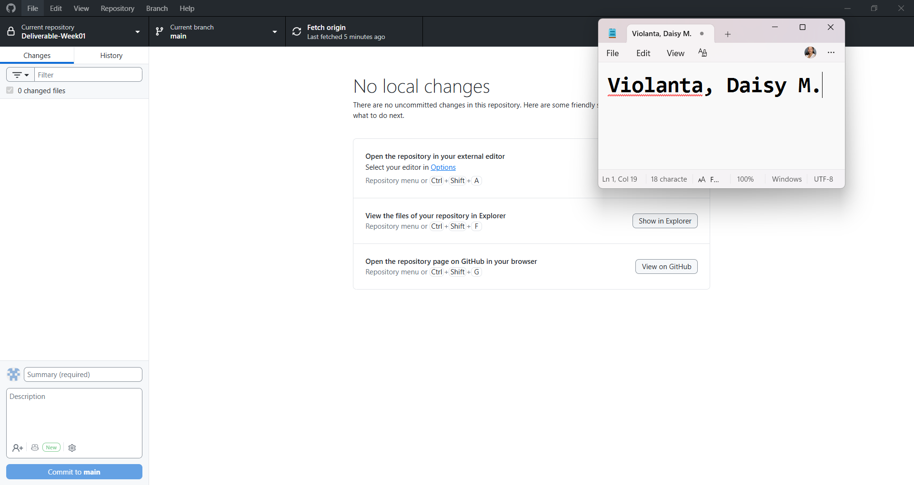
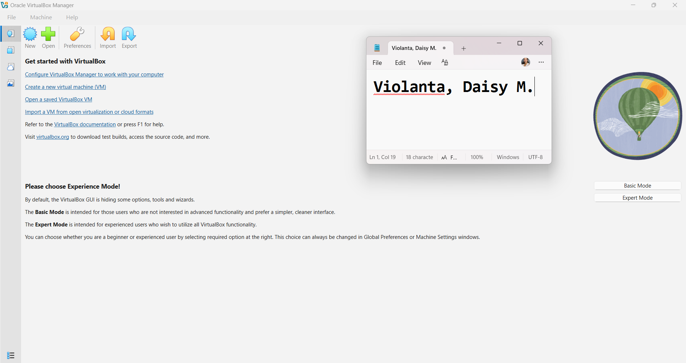
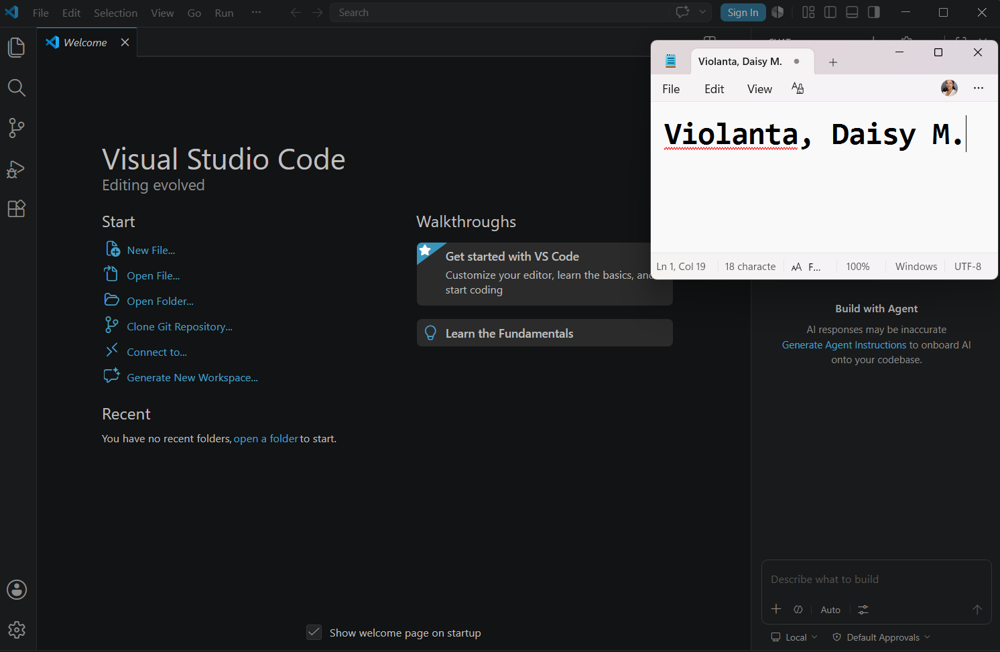
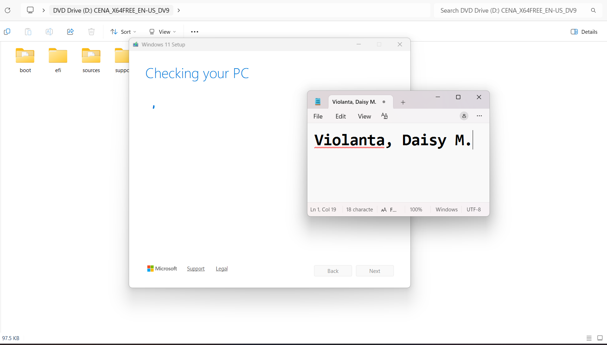

# Week 1 – Building My Professional Environment

## Student Information

- Name: Daisy M. Violanta
- Course: BS Information Technology
- Section: BSIT-4A
- Date: August 19, 2026
- Province: Laguna

# Objectives

- To set up my professional IT environment.
- To install and configure essential software.
- To create and organize my GitHub and LinkedIn accounts.
- To learn how these tools can support my future career in System Administration.

# Software Installed

 Git 
 GitHub Desktop 
 VS Code 
 VirtualBox 
 Ubuntu ISO 
 Windows ISO 

# Professional Accounts

GitHub: daisyviolanta1-cmd  
LinkedIn: Daisy M. Violanta

# Installation Screenshots

# Challenges Encountered

1. **Git installation:** I encountered some difficulties during the installation process. I solved them by following the installation instructions carefully.

2. **Ubuntu installation:** The installation took some time and encountered a few issues. I resolved them by checking the installation settings and following the proper steps.

3. **GitHub setup:** I had difficulty organizing my files and folders in GitHub. I solved this by learning how to create folders, upload files, and make commits.

---

# Reflection

This activity helped me understand the importance of setting up a professional environment as an Information Technology student. I learned how to install and configure software such as Git and Ubuntu and how these tools can be used for different IT tasks. I also learned how to create and organize a GitHub repository and use it to store my activities and screenshots.

Creating my GitHub and LinkedIn accounts also helped me understand the importance of building a professional online presence. GitHub can serve as a portfolio where I can showcase my projects, activities, and technical skills, while LinkedIn can help me connect with other IT professionals and future employers.

As a future System Administrator, these tools will help me develop important skills in system management, troubleshooting, documentation, and version control. This activity also taught me that patience and problem-solving are important when working with technology. Overall, Week 1 gave me a good foundation for developing my technical and professional skills.

---
