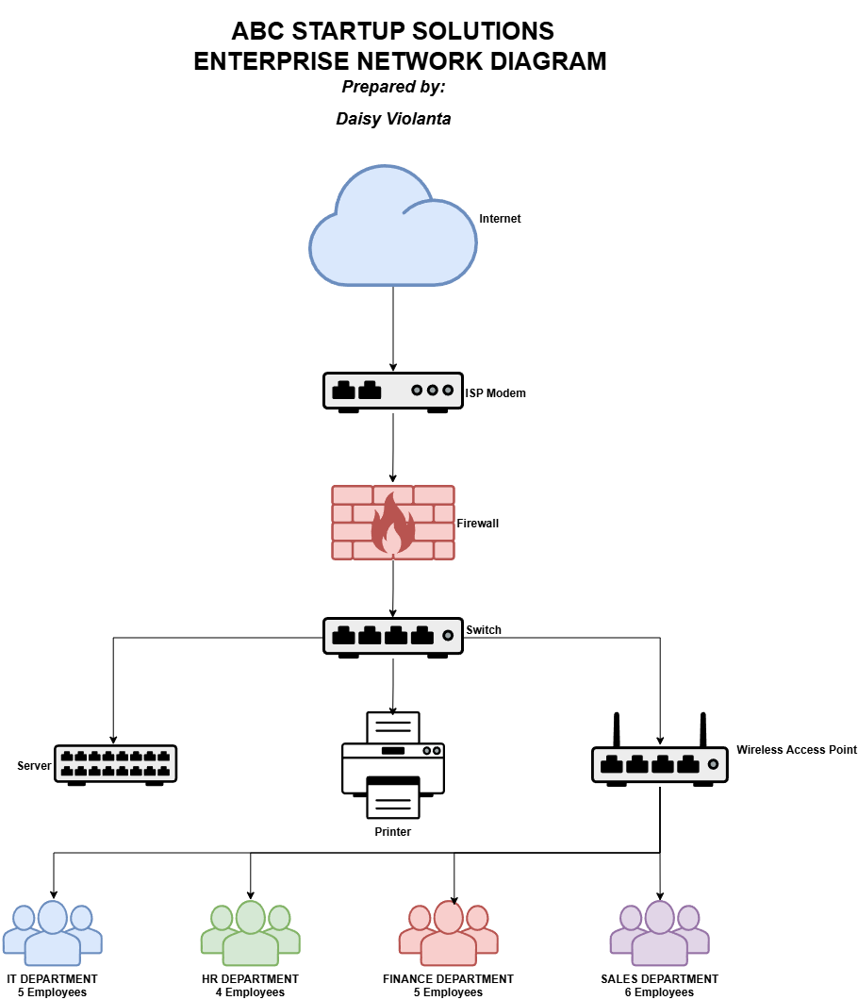

# Week 2 – Enterprise Infrastructure Planning

## Project Overview

This project is part of the Week 2 portfolio activity for ITEP 414 – System Administration and Maintenance. In this project, I took the role of a Junior System Administrator for **ABC Startup Solutions**, a newly established software development company with 20 employees.

The goal of the project is to plan the company's IT infrastructure before any equipment is purchased or installed. This includes identifying the required hardware, software, and networking equipment, designing the network topology, researching different system administration roles, and providing recommendations for the company's IT infrastructure.

This project also focuses on the importance of proper planning and documentation in setting up an organization's IT environment.

---

## Learning Objectives

Through this project, I was able to practice the following skills:

* Understanding the role and responsibilities of a System Administrator
* Identifying hardware, software, and networking requirements for a small organization
* Preparing hardware, software, and network inventories
* Designing an enterprise network topology
* Creating technical documentation using Markdown
* Planning an IT infrastructure based on an organization's needs
* Presenting technical information in an organized and professional way

---

## Company Scenario

**ABC Startup Solutions** is a newly established software development company with a total of **20 employees**. The company occupies a single office floor and is starting without computers, a server, network infrastructure, Internet infrastructure, or security policies.

The company is divided into four departments:

| Department             | Employees |
| ---------------------- | --------: |
| Information Technology |         5 |
| Human Resources        |         4 |
| Finance                |         5 |
| Sales                  |         6 |
| **Total**              |    **20** |

As the assigned Junior System Administrator, my task was to prepare an initial IT Infrastructure Plan that would support the company's operations.

---

## Hardware Inventory Summary

The hardware inventory was planned based on the company's 20 employees and its single-office-floor setup.

| Hardware              | Quantity | Main Purpose                               |
| --------------------- | -------: | ------------------------------------------ |
| Desktop Computers     |       20 | Primary workstations for employees         |
| Laptops               |        5 | Portable computers for IT activities       |
| Server                |        1 | Centralized server resources               |
| Router                |        1 | Network routing and connectivity           |
| Switch                |        1 | Wired network connectivity                 |
| Printer               |        2 | Shared printing                            |
| UPS                   |        3 | Power protection for critical IT equipment |
| Wireless Access Point |        2 | Wireless network connectivity              |
| NAS Storage           |        1 | Centralized network storage                |
| External Backup Drive |        2 | Backup storage                             |
| Monitors              |       20 | Displays for desktop workstations          |

The quantities were planned according to the size of the company and the requirements of the given scenario.

---

## Software Inventory Summary

The software inventory includes the software required in the project and other software needed to support the company's daily operations and IT activities.

| Software           | Main Purpose                               |
| ------------------ | ------------------------------------------ |
| Windows 11 Pro     | Operating system for employee computers    |
| Ubuntu Server      | Server operating system                    |
| Microsoft Office   | Documents, spreadsheets, and presentations |
| Visual Studio Code | Software development and code editing      |
| Git                | Version control                            |
| GitHub Desktop     | Git and GitHub management                  |
| VirtualBox         | Virtual machine management                 |
| Google Chrome      | Web browsing                               |
| Microsoft Defender | Security and malware protection            |
| AnyDesk            | Remote access and technical support        |
| 7-Zip              | File compression and extraction            |

These software tools were selected to support the company's workstations, software development activities, server environment, and basic IT administration requirements.

---

## Embedded Network Diagram

The network diagram was created using **Draw.io** based on the network requirements given in the project.

The diagram shows the connection between the Internet, ISP modem, router, firewall, switch, server, printer, wireless access point, and the four company departments.

### Network Diagram Preview

### Network Diagram Files

- [View Network Diagram – PNG](diagrams/NetworkDiagram.png)
- [View Network Diagram – PDF](diagrams/NetworkDiagram.pdf)
- [View/Edit Network Diagram – Draw.io](diagrams/NetworkDiagram.drawio)

---

## Technologies Used

The following technologies and tools were used or considered while completing the project:

* **Draw.io** – used to create the enterprise network diagram
* **GitHub** – used to store and organize the project files
* **Markdown** – used to create this README documentation
* **Windows 11 Pro** – planned workstation operating system
* **Ubuntu Server** – planned server operating system
* **Visual Studio Code** – planned software development tool
* **Git** – planned version control system
* **GitHub Desktop** – planned GitHub management tool
* **VirtualBox** – planned virtualization tool
* **Google Chrome** – planned web browser
* **Microsoft Defender** – planned security software
* **AnyDesk** – planned remote access and support tool
* **7-Zip** – planned file compression tool

---

## Challenges Encountered

One of the challenges I encountered was deciding what hardware and networking equipment would be appropriate for the company. The project provided the number of employees and departments, but it did not provide exact quantities for every piece of equipment. Because of this, I had to think about the company's size and determine reasonable quantities that could support its operations.

Another challenge was creating the network diagram. I had to understand how the different network components should be connected and how the departments would fit into the overall network. It also required me to make sure that the diagram included all of the components required by the project.

I also found the documentation part challenging because the information had to be organized clearly and professionally. This helped me understand that technical work is not only about configuring systems but also about properly documenting the decisions made during the planning process.

---

## Reflection

This project helped me understand that system administration involves more than installing computers or configuring networks. Planning is an important part of setting up an IT infrastructure because the system administrator needs to understand the organization's needs before choosing equipment and designing the network.

The most challenging part for me was planning the network infrastructure and deciding what equipment would be appropriate for ABC Startup Solutions. Since the company was starting without computers, a server, network infrastructure, Internet infrastructure, or security policies, I had to consider how the different resources would work together from the beginning.

I also learned that proper planning can help prevent unnecessary purchases, technical problems, and security issues. It can also make it easier for the company to expand its infrastructure in the future.

Overall, this project allowed me to practice infrastructure planning, inventory preparation, network design, technical documentation, and decision-making. As a BSIT student, I believe these skills will help me in future system administration activities, internship experiences, and eventually in working in the IT field.

---

## ## References

## References

### Project Module

- Laguna State Polytechnic University. *ITEP 414 – System Administration and Maintenance: Week 2 Portfolio Project – Enterprise Infrastructure Planning for a Startup Company.*

### System Administration and Networking

- Cisco. (2026). *CCNA – Cisco Certified Network Associate.*  
  https://www.cisco.com/site/us/en/learn/training-certifications/certifications/enterprise/ccna/index.html

- Cisco. (2026). *Cisco Certified Network Associate (200-301 CCNA).*  
  https://www.cisco.com/site/us/en/learn/training-certifications/exams/ccna.html

- Red Hat. (2026). *Red Hat Certified System Administrator (RHCSA).*  
  https://www.redhat.com/en/services/certification/rhcsa

- Red Hat. (2026). *Red Hat Certified System Administrator Exam (EX200).*  
  https://www.redhat.com/en/services/training/ex200-red-hat-certified-system-administrator-rhcsa-exam

### Cloud Administration

- Amazon Web Services. (2026). *AWS Certified Cloud Practitioner.*  
  https://aws.amazon.com/certification/certified-cloud-practitioner/

- Amazon Web Services. (2026). *AWS Certification Exam Guides.*  
  https://docs.aws.amazon.com/aws-certification/latest/examguides/aws-certification-exam-guides.html
